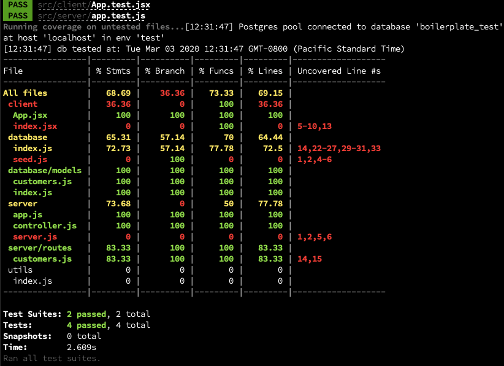

# www.nickzylstra.com
- Express
- PostgreSQL
- React
- Docker
- AWS
- Jest

## Setup

### Run at 'localhost':
UI with hot reload at http://localhost:4000

Express server API at http://localhost:3000
#### To startup:
- ensure docker is running
- clone repo to local machine
- run the following command from repo directory:

```
docker-compose up -d
```

#### To shutdown:
- run the following command from repo directory:
```
docker-compose down
```

### Run on AWS with Cloudflare protection:
Uses letsencrypt with Certbot for HTTPS, NGINX proxy, and CircleCI with Docker Hub CICD based on Github commits.
#### To deploy:
##### Docker Hub:
- create repo

##### Cloudflare:
- change domain registrar DNS servers to point at assigned Cloudflare DNS servers
- point Cloudflare to AWS Elastic IP that will be assigned to EC2 instance
- enable 'Full (strict) End to End' encryption to avoid redirect loop

##### Git Repo:
- update 'app_server' image (and container names if desired) using Docker Hub image here:
  - [docker setup](./docker-compose.prod.yml)
- update 'domain names' and 'emails' here:
  - [letsencrypt setup](./init-letsencrypt.sh)

##### AWS:
- create Amazon Linux 2 EC2 instance
- install Docker, Docker-Compose, and Git on instance
- clone git repo to EC2 instance
- stop EC2 instance, add text from file to 'user data' field for EC2 instance
  - [ec2 user data](./awsUserData.txt)
  - if Docker Hub repo is private - <em>only for EC2 version</em> - replace USERNAME and PASSWORD with actual values for Docker Hub
  - if not, comment out the Docker Login line
  - restart EC2 instance
- run the following commands from repo directory to setup encryption certs and start service:

##### CircleCI:
- connect github to CircleCI
- add repo as project to CircleCI
- add AWS ssh key to project secrets

```
docker-compose down
./init-letsencrypt.sh
docker-compose down
docker-compose -f docker-compose.yml -f docker-compose.prod.yml up -d
```

#### To update client or server code:
- push changes to Github branch tracked by Docker Hub (master currently)
- wait for Docker Hub to autobuild
- reboot EC2 instance
  - AWS userData script runs at every EC2 reboot, it will pull new image from Docker Hub

#### To update deployment scripts and files used outside of app_server image
- 'git pull' in repo on EC2 instance

#### To shutdown:
- run the following command from repo directory:
```
docker-compose down
```

## Route descriptions:
- Examples API calls here: [endpoints](./test-utils/APItests.http)
- The linked descriptions are manual tests most efficiently run in VS Code using the 'REST Client' extension.  They could also be ported to other testing programs using the examples as starting points.

## Testing

### To run automated tests: 
- Using npm and local postgres database with user 'test' and password 'test'
- clone repo to local machine
- run the following commands from repo directory:
```
npm install
npm run test
```
### To alter database user and password:
[Test setup config](./test-utils/globalTestSetup.js)

### Test results:

